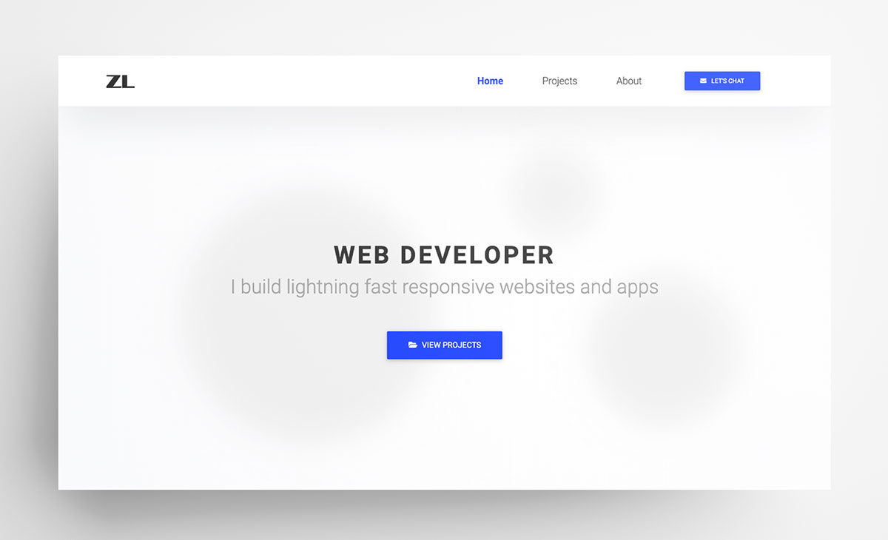

<!-- Status Badges -->

# Portfolio website V2

This is the second version of my web development portfolio website. The site is built with Gatsby and sources content from Prismic via GraphQL.

[View Website](https://zlutfi.com)

## Technologies Used

- Gatsby
- React
- GraphQL
- Prismic
- and more

## Features

- Dynamically generated Project custom type.
- Slices for creating unique sections for dynamic Project types.
- Sass Ready
- Font Awesome Icons
- Progressive Web App

> [!NOTE]
> &Copy; Z Lutfi. This site is a work in progress.
